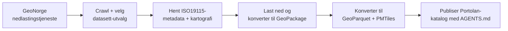

# PortoGeoNorge - Portolan SDI av GeoNorge

**TL;DR:**
- 20 datasett og metadata hentet automatisk fra GeoNorge, konvertert til Portolan-SDI og publisert som cloud native-filer (GeoParquet + PMTiles)
- Les mer om Portolan på https://www.portolan-sdi.org/
- Prøv katalogen selv: utforsk den visuelt i [Portolan Browser](https://browser.portolan-sdi.org/#/external/kartaistorage.blob.core.windows.net/skygeo/geonorge2portolan-poc/catalog.json)- La en agent som Claude Desktop koble seg rett på katalog-URL-en 
```
Jeg vil finne ut hvilke bygninger som ligger innenfor 5 km av Forsvarets skyte-og øvingsfelt.
Dette er datakatalogen jeg vil bruke: https://kartaistorage.blob.core.windows. net/skygeo/geonorge2portolan-poc/AGENTS.md
```

## Proof-of-Concept
Norge har allerede en solid geodatainfrastruktur i GeoNorge. Men dataene
ligger der i formater og tjenester bygget for GIS-verktøy — ikke for
LLM-er og AI-agenter som skal lese, koble og analysere data på egen hånd.
Denne PoC-en stiller spørsmålet: **hva skal til for å gjøre norske
geodata agent-klare?**

Svaret vi tester er [Portolan](https://portolan-sdi.org) — en åpen
STAC-katalog-standard bygget på skylagringsvennlige formater
(GeoParquet, PMTiles) og maskinlesbar dokumentasjon (`AGENTS.md`). Denne
PoC-en henter et utvalg datasett fra GeoNorge, beriker dem med ekte
ISO19115-metadata, og publiserer dem som en Portolan-katalog — helt
automatisk.

## Pipelinen



En kommando (`geonorge-poc run`) kjører hele kjeden: fra GeoNorges
Atom-feeder og CSW-metadatatjeneste, via nedlasting og normalisering, til
en ferdig STAC-katalog med GeoParquet-data, PMTiles-visualisering og
agent-dokumentasjon per datasett. Se
[README.technical.md](README.technical.md) for de tekniske detaljene.

Under panseret er det [Portolan CLI](https://portolan-sdi.org) som gjør
selve katalog-arbeidet:

```bash
# Én gang, ved oppstart
portolan init --auto --id <id> --title <tittel> --license <lisens>

# Per datasett
portolan add --force --thumbnails --pmtiles <collection>
portolan check <collection> --fix
portolan add --pmtiles <collection>

# Til slutt, for hele katalogen
portolan readme
portolan check . --fix
portolan add . --pmtiles --force
portolan check . --strict
```

## Resultatet

Kjøringen hentet **20 datasett** fra GeoNorge og publiserte **18** av dem
vellykket som en komplett Portolan-katalog — komplett med ekte metadata,
lisensinformasjon, autoritativ kartografi der den fantes, og
GeoParquet/PMTiles-data klar til bruk direkte fra sky-lagring, uten noen
GIS-server.

- **Katalogen (STAC/JSON):**
  https://kartaistorage.blob.core.windows.net/skygeo/geonorge2portolan-poc/catalog.json
- **Utforsk katalogen visuelt i Portolan Browser:**
  https://browser.portolan-sdi.org/#/external/kartaistorage.blob.core.windows.net/skygeo/geonorge2portolan-poc/catalog.json

## Eksempel: analyse med Claude Desktop

Fordi hver samling har en `AGENTS.md` med data-plassering, skjema og
eksempelspørringer, kan en agent som Claude Desktop koble seg rett på
katalog-URL-en og selv finne ut hvilke datasett som finnes og hvordan de
skal brukes — uten forhåndskonfigurert integrasjon. Under er et eksempel
der Claude Desktop, med kun katalog-lenken som input, kobler
"Skytefelt (land)" og "N250 Bygninger og anlegg" for å finne bygninger
innenfor 5 km av Forsvarets skyte- og øvingsfelt, og bygger en
interaktiv rapport:


## Konklusjon

PoC-en viser at norske åpne geodata kan gjøres tilgjengelige for
AI-agenter i dag, med eksisterende data og et automatisert
publiseringssteg — ikke en ny geodatainfrastruktur fra bunnen av.
